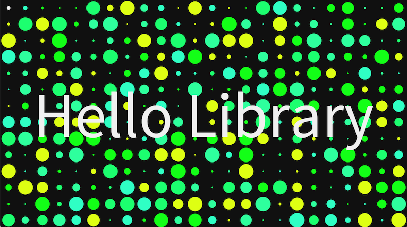

# Processing Library Template

The Processing Library Template is a template to help developers of Processing libraries to develop and release.
It can be found on Github at [https://github.com/processing/processing-library-template](https://github.com/processing/processing-library-template).

This documentation provides information on

1. [Getting started](getting-started.md)
2. [The development process](develop)
3. [Releasing your library](release)
4. [Troubleshooting](troubleshooting.md)

!!! note
    This template is based on Gradle. If you are looking for the old Ant-based template, see processing/processing-library-template-ant

## References 
Existing references for developing libraries for Processing can be found on the following Github wiki pages:

- [https://github.com/processing/processing4/wiki/Library-Basics](https://github.com/benfry/processing4/wiki/Library-Basics)
- [https://github.com/processing/processing4/wiki/Library-Guidelines](https://github.com/benfry/processing4/wiki/Library-Guidelines)
- [https://github.com/processing/processing4/wiki/Library-Overview](https://github.com/benfry/processing4/wiki/Library-Overview)

## Contributors

This template was created as part of the 2024 New Beginnings (pr05) Grant from the
[Processing Foundation](https://github.com/processing), to simplify the
workflows for libraries, tools, and modes, mentored by [@Stefterv](https://github.com/stefterv).

It is based on and inspired by a number of Processing library templates, including:

- [https://github.com/processing/processing-library-template-gradle](https://github.com/processing/processing-library-template-gradle)
- [https://github.com/enkatsu/processing-library-template-gradle](https://github.com/enkatsu/processing-library-template-gradle)
- [https://github.com/hamoid/processing-library-template/](https://github.com/hamoid/processing-library-template/)

I wish to thank the developers of these repositories, who generously provided
guidance and time. This template has been developed in collaboration with
[@enkatsu](https://github.com/enkatsu).

The example library was developed by Stig Møller Hansen ([@stixan](https://github.com/stixan)).
